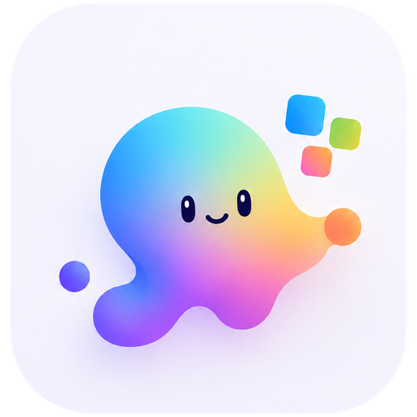
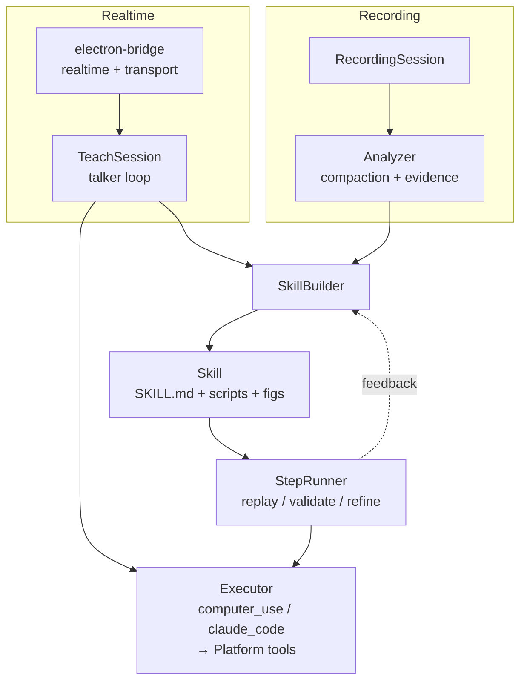

<p align="center">
  
</p>

# Protean: Show the work. Build the worker. 

> Protean extends agents beyond their native capabilities, turning everyday demonstrations into multimodal skills they can use across real work environments to automate, adapt, and evolve into autonomous digital workers.

Protean is a skill infrastructure for agents like **Codex, Claude Code, OpenClaw**, and other agents.

It lets agents learn real workflows from how users already work: screen demonstrations, realtime teaching, guided execution, hand-written skills, or imported skill libraries. Protean turns that operational knowledge into reusable multimodal Skills that can be replayed, validated, refined, transferred, and adapted.

With Protean, agents are no longer limited to what they can solve from code, APIs, prompts, or built-in tools alone. They can learn how work is actually done across screens, apps, tools, documents, meetings, terminals, browsers, enterprise systems, and domain-specific environments.

A user does not need to learn scripting, RPA tools, APIs, or new automation concepts. They simply perform the workflow once, the way they already know how to do it. Protean observes, understands, and converts that demonstration into a stable executable skill.

When a workflow is unclear, fails, or encounters a changed environment, Protean can bring the user back into the loop through a realtime call or screen-sharing session, ask for guidance, and refine the skill from that correction.

## Why Protean Exists

Modern agents are getting better at reasoning, coding, and tool use. But they still lack durable **procedural memory**: the ability to remember how work is done, improve through repetition, and transfer that knowledge across tasks, tools, agents, and environments.

Many valuable workflows are not exposed as clean APIs. They live in GUI tools, internal systems, desktop apps, meetings, enterprise software, browser flows, documents, and domain-specific procedures. Today, automating these workflows often requires professional expertise, custom scripts, brittle RPA pipelines, or repeated manual effort.

Protean changes that.

It gives agents a shared infrastructure for learning, refining, managing, and reusing operational skills. A workflow that once required an expert to analyze, document, script, debug, and maintain can become learnable from a simple demonstration.

Each learned workflow becomes a structured Skill. Each execution produces new traces, screenshots, verification results, user corrections, and environment signals. Protean uses these to refine the skill over time.

Over many workflows, these skills form a **unified multimodal skill graph**: a procedural memory layer that connects tasks, actions, tools, screens, domain knowledge, verification signals, and execution history.

## What Protean Enables

Protean helps agents:

- Learn workflows from ordinary user demonstrations.
- Automate GUI and multimodal tasks across real environments.
- Turn expert procedures into reusable executable skills.
- Validate, repair, and refine skills through repeated execution.
- Ask users for realtime guidance when the environment changes.
- Manage accumulated skills as long-term procedural memory.
- Transfer operational knowledge across agents and deployments.
- Generalize from taught workflows to new domain tasks.

The more a user teaches Protean, the more the connected agent can do autonomously. It starts by replaying demonstrated workflows, then adapts those skills to nearby tasks, then accumulates domain knowledge into a growing operational memory.

Protean is not another agent.

It is the infrastructure that lets any agent evolve from a task solver into an **autonomous digital worker** with accumulated knowledge, skills, and the ability to keep learning from work itself.

---

## Features

Today Protean ships the desktop-automation slice of that vision end-to-end:

- **Skill lifecycle**: teach → finalize → [replay → validate → refine]↻
- **Self-improving**: every validated run feeds the trajectory back into an
  LLM-driven refiner that tightens step descriptions, tool hints, and
  verification conditions.
- **Multiple entry channels**: recorded screen demonstrations, realtime
  voice/screen-share sessions (Gemini Live, via an Electron bridge),
  zero-shot task prompts, hand-edited `SKILL.md`, agent self-refinement,
  or imports from another deployment's skill library.
- **Cross-platform target**: macOS (Quartz + AX), Windows (UI Automation),
  Linux (stub).
- **Multi-provider LLM**: OpenAI, Anthropic, Gemini, and Doubao (Ark) for
  offline skill generation.
- **Cross-platform tool suite**: `screenshot`, `click`, `click_at`,
  `type_text`, `key_press`, `find_elements`, `activate_app`, `menu_click`,
  `select_option`, `list_elements`, `list_menu` — driven directly by
  `computer_use` (default), or exposed to external CLI agents
  (`claude_code` via `-E claude_code`) through the in-process MCP surface
  in `protean/executor/mcp.py`.
- **Step idempotency**: each step carries an `idempotent` flag; the validator
  retries idempotent failures and escalates the rest.
- **Capture-proof overlay** (`--overlay`): floating log window invisible to
  screen-capture APIs, so the executor never sees its own logs.

Skills are self-contained directories: a `SKILL.md` (Markdown + YAML
frontmatter) for instructions, verify conditions, and idempotency flags,
plus optional `scripts/` (executable helpers the skill can invoke) and
`figs/` (reference images carried over from the original demonstration).
All human-editable, version-controllable, and shareable.

## Requirements

- **Python 3.12 – 3.13** managed via [`uv`](https://docs.astral.sh/uv/).
- **An LLM provider key** in `.env` (at least one of OpenAI / Anthropic /
  Gemini / Doubao).
- **`ffmpeg` + `ffprobe` on PATH** — required by `generate` (frame
  extraction, scene detection, audio mux) and by the recorder backends
  (Windows screen capture, macOS audio capture).
  - macOS: `brew install ffmpeg`
  - Windows: `winget install Gyan.FFmpeg` (or `choco install ffmpeg`)
  - Linux: `apt install ffmpeg` (or distro equivalent)
- **macOS**: grant Accessibility + Screen Recording permissions to your
  terminal.
- **Windows**: native input + UIA backend; no extra permissions, but run from
  an interactive session.
- **Node.js**:
  - **Node ≥ 22** is required for the realtime voice path (Electron bridge).
  - Node ≥ 18 is enough if you only use the Computer-Use Agent terminal tool
    (via DesktopCommanderMCP); opt out entirely with
    `PROTEAN_CUA_TERMINAL=false`.
- **Claude Code CLI** on PATH (only if you use `-E claude_code`).

## Install

The setup script bootstraps everything: clones the repo (if needed),
offers to install `uv`, runs `uv sync`, creates `.env`, checks
`ffmpeg`/Node, optionally builds the electron-bridge, and optionally
wires Codex / Claude Code. Idempotent — safe to re-run for upgrades.

Download and run from anywhere; it will clone Protean into `~/.protean`
on first run:

```bash
# macOS / Linux
bash <(curl -fsSL https://raw.githubusercontent.com/AIBrain-Mnemis/Protean/main/scripts/setup.sh)

# Windows (PowerShell)
iex (irm https://raw.githubusercontent.com/AIBrain-Mnemis/Protean/main/scripts/setup.ps1)
```

If you already cloned the repo manually, just run the script in place —
it detects the checkout and skips the clone step:

```bash
git clone https://github.com/AIBrain-Mnemis/Protean.git
cd Protean
./scripts/setup.sh        # or .\scripts\setup.ps1 on Windows
```

The script is interactive — every optional step (electron-bridge,
external agent runtimes, provider keys) is a prompt. Press Enter to take
the default shown in brackets. An existing `.env` is **never
overwritten**: each provider/realtime/ASR section shows the current
value and asks whether to change it.

To undo what setup did, run the matching teardown script from the
checkout:

```bash
# macOS / Linux
./scripts/uninstall.sh

# Windows (PowerShell)
.\scripts\uninstall.ps1
```

Non-interactive: it unwires Codex / Claude Code, then removes
`electron-bridge` build artifacts, `.venv`, `.env`, and the clone
itself (only when running from `~/.protean`). Shared tools (uv, ffmpeg,
node) are left alone.

See [`.env.example`](.env.example) for every supported variable and
[`protean/config.py`](protean/config.py) for the in-code default models.

## Usage

All commands run via `uv run protean ...` — never bare `python`.
This section is organized by **entry channel** — pick the one that
matches how you want capability to enter Protean.

### 1. Recorded screen demonstration

Capture a session of you doing the task; an LLM turns the recording
into a `Skill` afterwards.

```bash
uv run protean record -o ./recordings/my-task   # Ctrl-C to stop
uv run protean generate ./recordings/my-task -d "Create a calendar event"
```

**Pass `-d "..."` on `generate`.** The task description grounds the LLM
when it labels steps, picks verification strategies, and infers
idempotency. A generation without `-d` still produces a skill, but it
tends to be more literal ("clicked button at (X, Y)") and less reusable.
Decide the description before you start recording — even though `record`
itself doesn't take it.

Other useful flags:

```bash
uv run protean record -d 1                              # display 1
uv run protean generate ./rec -d "..." -p anthropic -m claude-opus-4-6
```

**Tip:** for repeated recording, run the daemon (channel 2) and use the
`Alt+Shift+R` hotkey (`Option+Shift+R` on macOS) — it starts/stops the
recording, prompts you for the task description, and chains into
`generate` automatically. No need to chain commands by hand.

### 2. Realtime voice / screen-share session

Talk to a realtime LLM (Gemini Live, via the Electron bridge) and share
screens in either direction — the agent can watch you work
(`start_screen(mode="observe")`), or share its own screen for you to
watch it work (`start_screen(mode="share")`). Build the bridge once with
`setup.sh` (it prompts), then start the daemon:

```bash
uv run protean daemon
uv run protean daemon --overlay         # add the capture-proof overlay
uv run protean daemon -p anthropic -m claude-opus-4-6   # generation provider
```

The daemon supervises the bridge subprocess and combines two flows:

1. **Hotkey-driven recording** — `Alt+Shift+R` (`Option+Shift+R` on
   macOS) starts/stops a screen recording; on stop, Protean prompts
   for the task description and auto-runs `generate`. The smooth path
   for channel 1. Override via `--hotkey`.
2. **Realtime voice auto-answer** — when a remote user joins the
   configured presence/RTC service, the bridge fires a `ringing` event
   and the daemon auto-starts a `TeachSession`.

### 3. Zero-shot task prompt

Skip the skill creation step entirely. Hand the agent a natural-language
task and let it figure out execution from scratch.

```bash
uv run protean skills run -t "Open Calculator and compute 1+1"
uv run protean skills run -t "..." --overlay
```

Useful for one-off tasks, or to see whether the executor can handle the
shape of the work before you invest in capturing a skill.

### 4. Hand-edit a SKILL.md

Skills live as directories under your skills directory
(`PROTEAN_SKILLS_DIR`). Open `SKILL.md` in any editor, change steps /
verify conditions / idempotency flags, save. `uv run protean skills
list` picks up changes immediately.

### 5. Import another deployment's skill library

Drop a skill directory (`SKILL.md` + `scripts/` + `figs/`) into your
skills directory. It is now your own — list, run, refine.

### 6. Agent self-refinement during execution

Add `--refine` to any `skills run` and the full execution trajectory
(instructions, executor tool calls, verification outcomes, screenshots)
feeds back into `SkillBuilder.refine()`, which uses an LLM to sharpen
the skill before the next run.

```bash
uv run protean skills run my-skill --refine
```

### Equip an external agent (Codex / Claude Code)

If you ran `setup.sh` and answered yes when it offered to wire Codex /
Claude Code, **this is already done** — skip to the re-sync note below.

Otherwise, run `agents setup` to make **Codex** or **Claude Code** invoke
Protean from inside its own sessions. It copies the local skill library
into the runtime's skills directory and injects a sentinel-delimited
block into the runtime's session-start instructions file
(`~/.codex/AGENTS.md` for Codex, `~/.claude/CLAUDE.md` for Claude Code)
that tells the model to load the Protean bootstrap skill at the start
of every new chat.

```bash
uv run protean agents setup codex
uv run protean agents setup claude_code
```

Re-run the same command after updating Protean to refresh the bootstrap
skill and resync the library — the sentinel block is replaced in place
without touching the rest of your instructions file. Most pipelines
(`generate`, `daemon` hotkey, `trajectories evolve`, `skills run
--refine`) also auto-resync every installed runtime, so you usually
don't need to re-run setup by hand.

To remove Protean from a runtime:

```bash
uv run protean agents uninstall codex
uv run protean agents uninstall all       # every installed runtime
```

Uninstall removes only the Protean-managed skill folders (never
user-authored skills sitting alongside) and strips the sentinel block
from the instructions file, deleting the file entirely if nothing else
remains. Idempotent and safe to re-run.

For a full teardown that also cleans the electron-bridge build, `.venv`,
`.env`, and the cloned repo, run [`./scripts/uninstall.sh`](scripts/uninstall.sh)
(or `scripts\uninstall.ps1` on Windows).

### Running and managing skills

```bash
uv run protean skills list                          # list installed skills
uv run protean skills show SKILL_NAME               # inspect SKILL.md
uv run protean skills run SKILL_NAME                # replay end-to-end
uv run protean skills run SKILL_NAME -v             # stream executor events
uv run protean skills run SKILL_NAME -E claude_code # use Claude Code executor
uv run protean skills run SKILL_NAME --overlay      # capture-proof overlay
uv run protean skills run SKILL_NAME -p key=val     # parameterized
```

Further flags (run `uv run protean skills run --help` for the full list):

- `-s / --stepwise` — execute and verify each step individually
  (drives Skill lifecycle § 4 *Validate*).
- `-a / --assist` — on failure, ask back via the attached `AssistantChannel`
  (Skill lifecycle § 5 *Assisted validate*).
- `--working-dir DIR` — override the executor's CWD (defaults to `~`).

And on `generate`:

- `--validate` — auto-run validation after generation.
- `--no-images` — text-only analysis (skip frame screenshots).

### Executors

Protean ships two executor backends; pick with `-E` on `daemon` and
`skills run`:

- **`computer_use`** (default) — Anthropic / OpenAI Computer Use API.
  Needs `ANTHROPIC_API_KEY` (or the configured default provider's key)
  and a vision-capable model. The model drives the GUI and Protean's
  Platform layer is called directly from the agent loop.
- **`claude_code`** — Claude Code CLI driven via `claude-agent-sdk`.
  Needs the Claude Code CLI on `PATH` and an `ANTHROPIC_API_KEY`. The
  SDK manages the CLI subprocess; Protean's Platform tools are exposed
  to it through the in-process MCP surface in
  `protean/executor/mcp.py`. Same tool surface, different driver loop.

### Bridge env vars (channel 2)

Realtime model selection lives in bridge-side env (set in `.env`):

```env
PROTEAN_BRIDGE_REALTIME=gemini
GEMINI_API_KEY=...
PROTEAN_REALTIME_MODEL=gemini-3.1-flash-live-preview
```

## Skill lifecycle

1. **Teach** — record a demonstration, or talk to the realtime LLM while it
   observes via `start_screen(mode="observe")`.
2. **Finalize** — an LLM rewrites the captured steps into a polished `Skill`
   (instructions, verify conditions, idempotency flags, success criteria).
3. **Replay** — `skills run` sends the rendered SKILL.md to the executor for
   autonomous end-to-end execution.
4. **Validate** — replay + post-execution check of each `step.verify_condition`
   through the verifier's fallback chain
   (`ax_element` → `text_content` → `visual`).
5. **Assisted validate** — same as Validate, but on failure the executor can
   ask back via the attached `AssistantChannel` (CLI dialog or the realtime
   talker).
6. **Refine** — every validated run feeds the full trajectory (instructions
   sent, executor actions, verification outcomes, screenshots) into
   `SkillBuilder.refine()`, which uses an LLM to sharpen the skill.

## Architecture

The diagram below shows the two entry channels that have their own
runtime architecture — recording and realtime — both feeding into the
same `Skill` schema. The other four channels (zero-shot, hand-edited
`SKILL.md`, import, self-refinement via `--refine`) are file or flag
operations and don't need separate flows.



Layer roles:

- **`protean/platform/`** — OS abstraction. Everything OS-specific (Quartz, AX,
  UIA, input simulation, screenshots) goes through this layer.
- **`protean/executor/`** — GUI execution backends. Two are shipped:
  `computer_use` (Anthropic / OpenAI Computer Use API — the default,
  internal agent that calls Platform directly) and `claude_code` (Claude
  Code CLI via `claude-agent-sdk`, an external CLI agent). External CLI
  executors plug into Platform through the in-process MCP surface in
  `protean/executor/mcp.py`.
- **`protean/channels/`** — `AssistantChannel` protocol + the Electron-bridge
  IPC client (TypeScript schema is mirrored 1:1 in
  [`electron-bridge/src/protocol.ts`](electron-bridge/src/protocol.ts) and
  [`protean/channels/_protocol.py`](protean/channels/_protocol.py)).
- **`protean/realtime/`** — `TeachSession` (the talker loop), tool
  declarations, and tool dispatchers.
- **`protean/recorder/`** + **`protean/analyzer/`** — the offline path:
  capture → compact events → extract paired (overview + detail) frames →
  LLM.
- **`protean/skills/`** — schema, renderer, registry, builder, runner,
  verifier, refiner.

## Roadmap

Things known to be incomplete:

- **Element identification: UIA → vision-first.** OS accessibility APIs are
  fragile across apps, versions, and locales. Plan: downgrade UIA/AX to a
  best-effort hint (~200 ms, non-blocking), and use the detail-crop
  screenshot (400×400 around click coords) plus a vision model as ground
  truth.
- **Windows + Linux backends.** Windows has a working UIA layer; Linux is a
  stub.
- **Cross-run skill evolution.** Aggregating trajectories across many runs to
  evolve a skill more aggressively than per-run `refine()`.
- **Drag toolkit function** — `drag(app, from_label, to_label)`.

## Development

- Use `uv run protean ...`, not bare `python -m protean`.
- Lint: `uv run ruff check protean tests`.
- Tests: `uv run pytest` (async tests work without decorators —
  `asyncio_mode = "auto"`).
- The Python package is Python-only. PCM, screen frames, and TRTC live in the
  `electron-bridge` Node subproject — never mix `uv` and `npm` in the same
  command.

## About us

We work on **LLM agents** — systems that act on real software and real
environments, remember what they've done, and get better the more they're
used. Protean is one piece of that. The other we've shipped:

- **[Mnemis](https://github.com/microsoft/Mnemis)** — Dual-Route
  Retrieval on Hierarchical Graphs for Long-Term LLM Memory (ACL 2026).
  Where Protean owns procedural memory ("how to do things"), Mnemis
  owns semantic memory ("what an agent knows"). Combines System-1
  similarity search with a System-2 global selection mechanism over a
  hierarchical concept graph; SOTA on LoCoMo (93.9) and LongMemEval-S
  (91.6) with GPT-4.1-mini.

If you're building agents that need to act, remember, and improve — we'd
love your stars, issues, and PRs.

## Citation

If you find this work useful, please star this repo and cite:

```bibtex
@inproceedings{tang2026mnemis,
  title     = {Mnemis: Dual-Route Retrieval on Hierarchical Graphs for Long-Term LLM Memory},
  author    = {Tang, Zihao and Yu, Xin and Xiao, Ziyu and Wen, Zengxuan and Li, Zelin and Zhou, Jiaxi and Wang, Hualei and Wang, Haohua and Huang, Haizhen and Deng, Weiwei and Sun, Feng and Zhang, Qi},
  booktitle = {Proceedings of the 64th Annual Meeting of the Association for Computational Linguistics (ACL 2026)},
  year      = {2026},
  address   = {San Diego, California, USA},
  publisher = {Association for Computational Linguistics},
  note      = {Accepted to ACL 2026 Main Conference},
  url       = {https://arxiv.org/abs/2602.15313}
}
```

## License

[MIT](LICENSE).
